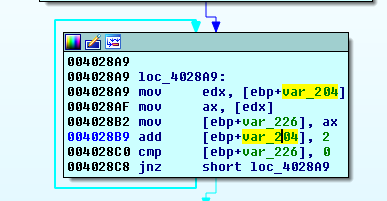

# Challenge 3

Download the challenge from [here](unknown)

## Start

### Overview

This challenge is a lot more complicated and involves some dynamic analysis.

Firstly, lets find the function we're interested in!

#### Function 0x4027A0

Based on the callgraph alone, this appears to be a large and complex function.

However, we can slowly reverse the function to attempt at figuring out what is going on.

Firstly, the function takes in has two parameters, could you try to figure out how the two parameters are derived from?

The first parameter is derived from the number of arguments provided to the program.

##### Activity - 20~30 minutes

**[Activity]** Could you try to figure out where the second parameter comes from?

The second parameter is used immediately in a function call at **0x4027CE**.

**[Activity]** Figure out what the value of second parameter should be.  
***Hint: what does the file-extension `.pdb` used for?***

We also see that the user-defined function at **0x402760** is being used at multiple places.

**[Activity]** What does the function at **0x402760** look like its doing?

Here's the Python version of the function, might be useful later. :)

```
def calculate(a):
    count = 0
    for i in a:
        count = ord(i) + (37 * count)
        count = count % (0xffffffff+1)
    return count
```

Moving on, we immediately see some constant values being loaded into the program, can you identify the values?

**[Activity]** What is the value being stored into local variables here?

Next up, we see some sort of iteration in the callgraph view.



The loop seems to be dependent on the value contained in `[ebp + var204]`.

**[Activity]** What is the contents of `[ebp + var204]`?  
***Hint: Make use of a debugger to find out easily!***

After which, we see two local variable assignments.

**[ebp + var_218]** is being assigned the value of the first argument provided to the program.
**[ebp + var_220]** is being assigned the address of some unknown chunk of data.

The next few basic blocks doesn't seem to be doing anything dynamic.

_wfopen is the wide-character version of fopen used to open a file for read/write. It seems to be opening the binary itself for reading.

It reads 0x40000 bytes into a chunk of heap allocated previously.

**[Food for thought]** What do you think this section is trying to achieve?

Let's now move on to **0x402AC2**.

We see a few instructions involving `shl`, `and` and `or`.

I've rewritten the instructions into a more readable form:  
`([ebp+var_224]<<0x10) | ([ebp+var_1F4] & 0xffff)`

##### Activity - 10 minutes

**[Activity]** Can you figure out what values are being used here? Which of these are controlled by you?

The next part is pretty complex and has to do with decrypt the unknown chunk of data we discovered earlier!

**[Activity]** Can you figure out which of the following values controlled by us influences the decryption?

1. Filename
2. Command Argument
3. Length of Command Argument #1

We are pretty close to figuring out what is going on now! :)

##### Activity - 15 minutes

**[Activity]** Can you figure out the correct values in order to decrypt the unknown chunk of data correctly?

Now that we are closer to the end of the function, can you see which basic block we need to reach to solve the challenge?

##### Activity - 30 minutes

There is a for-loop that iterates for 0x1B times.

**[Activity]** Figure out what the for-loop is doing.

There doesn't seem to be a way to directly reverse the challenge binary in order to get the flag. It seems like we need to brute-force a little.

**[Activity]** Write a script to brute-force and obtain the flag!  

The decrypted unknown chunk of data is provided below for convenience!

```
['ee613e2f', 'de79eb45', 'af1b2f3d', '8747bbd7', '739ac49c', 'c9a4f5ae', '4632c5c1', 'a0029b24', 'd6165059', 'a6b79451', 'e79d23ba', '8aae92ce', '85991a18', 'fee05899', '430c7994', '1ab9f36f', '70c42481', '05bd27cf', 'c4ff6e6f', '5a77847c', 'dd9277b3', '25843cff', '5fdca944', '8ee42896', '2ae961c7', 'a77731da']
```